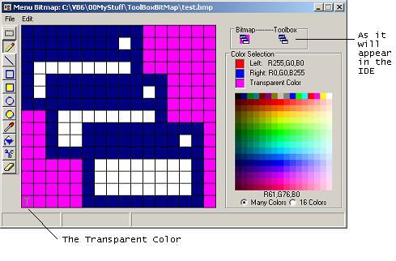



## Toolbox Bitmap Editor

### Description

This is a tool to help with building the ToolboxBitmap pictures for your usercontrols.

The docs state that best results are obtained by using a 16x15 bitmap. Through experimentation I've learned that the Transparent color the IDE uses is at x=0, y=14 (lower left corner). Enjoy.
 
### More Info
 

             |
---                |---
**Submitted On**   |2010-01-20 10:28:30
**By**             |[Norm Cook](https://github.com/Planet-Source-Code/PSCIndex/blob/master/ByAuthor/norm-cook.md)
**Level**          |Advanced
**User Rating**    |5.0 (25 globes from 5 users)
**Compatibility**  |VB 6\.0
**Category**       |[Custom Controls/ Forms/  Menus](https://github.com/Planet-Source-Code/PSCIndex/blob/master/ByCategory/custom-controls-forms-menus__1-4.md)
**World**          |[Visual Basic](https://github.com/Planet-Source-Code/PSCIndex/blob/master/ByWorld/visual-basic.md)
**Archive File**   |[Toolbox\_Bi2173231202010\.zip](https://github.com/Planet-Source-Code/norm-cook-toolbox-bitmap-editor__1-72855/archive/master.zip)

